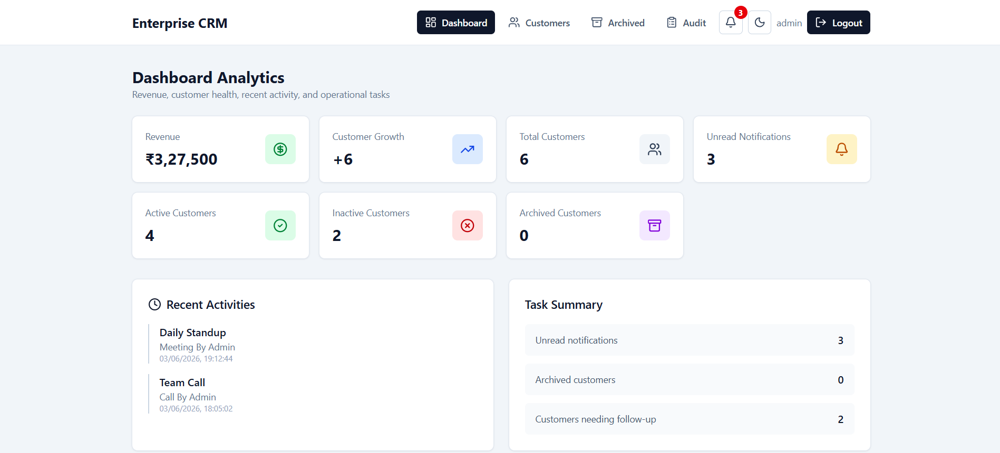

# Enterprise CRM Dashboard



<p align="center">
  <a href="https://enterprise-crm-tau.vercel.app/" target="_blank">
    
  </a>
</p>

<p align="center">
  <a href="https://enterprise-crm-tau.vercel.app/" target="_blank">
    https://enterprise-crm-tau.vercel.app/
  </a>
</p>


A production-ready Customer Relationship Management (CRM) platform built with React, TypeScript, Redux Toolkit, Axios, Formik, and Zod. The application enables organizations to manage customers, contacts, activities, notifications, audit logs, and business analytics through a scalable and maintainable architecture.

---

## Live Demo

🔗 https://enterprise-crm-tau.vercel.app/

---

## Overview

This project demonstrates both React Fundamentals and Enterprise-Level React Development Patterns commonly used in modern SaaS applications.

The application is designed with reusable components, centralized state management, secure authentication, API abstraction, performance optimization, and scalable folder architecture.

---

## Features

### Dashboard Analytics

* Revenue Overview
* Customer Growth Tracking
* Recent Activities
* Task Summary Dashboard
* Business Performance Insights

### Customer Management

* Add Customer
* Edit Customer
* Archive Customer
* Restore Archived Customer
* Customer Search & Filtering
* Customer Profile Management

### Contact Management

Support for multiple contact types:

* Primary Contact
* Billing Contact
* Technical Contact

### Activity Timeline

Track customer interactions:

* Calls
* Meetings
* Emails
* Notes

### Notifications

* In-App Notifications
* Unread Notification Count
* Real-Time Updates

### Audit Logs

* Created By
* Updated By
* Updated Date
* Activity History

### Authentication & Authorization

* JWT Authentication
* Protected Routes
* Role-Based Access Control (RBAC)
* Session Management
* Auto Logout on Token Expiration
* Refresh Token Handling
* API Authorization

---

## React Concepts Applied

### React Fundamentals

* JSX
* Components
* Props
* State
* Event Handling
* Conditional Rendering
* Lists & Keys
* Forms

### React Hooks

* useState
* useEffect
* useMemo
* useCallback
* useRef

### Advanced React Concepts

* Custom Hooks
* Context API
* React Router
* Protected Routes
* Lazy Loading
* Code Splitting
* Component Composition
* Reusable Component Architecture

### Form Handling & Validation

* Formik
* Zod Validation
* Dynamic Forms
* Custom Form Components

---

## State Management

### Redux Toolkit

* createSlice
* createAsyncThunk
* RTK Query (Optional)
* Redux Persist

### Store Modules

* Authentication
* Customer Management
* Notifications
* Dashboard Analytics

---

## API Layer

### Features

* Axios Instance
* Request Interceptors
* Response Interceptors
* Global Error Handling
* Token Refresh Mechanism
* API Service Layer
* Reusable API Utilities

---

## Custom Hooks

* useAuth
* usePagination
* useDebounce
* useApi

---

## Performance Optimization

### Techniques

* useMemo
* useCallback
* React.memo
* Lazy Loading
* Code Splitting
* Optimized Re-rendering

---

## Tech Stack

### Frontend

* React
* TypeScript
* JavaScript (ES6+)
* React Router
* Bootstrap / React Bootstrap

### State Management

* Redux Toolkit
* Redux Persist
* RTK Query (Optional)

### Form Management

* Formik
* Zod

### API Integration

* Axios

### Development Tools

* Git
* GitHub
* ESLint
* Prettier

---

## Project Structure

```text
src/
├── assets/
├── components/
├── pages/
├── layouts/
├── routes/
├── services/
├── hooks/
├── schemas/
├── types/
├── utils/
├── store/
│   ├── auth/
│   ├── customer/
│   ├── notification/
│   └── index.ts
├── App.tsx
└── main.tsx
```

---

## Enterprise Architecture Highlights

* Modular Folder Structure
* Reusable Components
* Centralized State Management
* Centralized API Layer
* Role-Based Access Control
* Authentication & Authorization
* Audit Logging
* Notification Management
* Form Validation
* Error Handling
* Scalable Code Organization
* Performance Optimization
* Maintainable Enterprise Architecture

---

## Installation

```bash
git clone <repository-url>
npm install
npm run dev
```

---

## Build for Production

```bash
npm run build
```

---

## Learning Objectives

* React Fundamentals
* TypeScript
* React Router
* Formik & Validation
* Redux Toolkit
* API Integration
* Authentication & Authorization
* Enterprise Architecture Patterns
* Performance Optimization
* Scalable Frontend Development

---

## Project Showcase

This enterprise CRM platform was developed using React, TypeScript, Redux Toolkit, Axios, Formik, and Zod.

The application provides customer management, contact management, activity tracking, notifications, audit logs, and dashboard analytics through a scalable and maintainable architecture.

State management is implemented using Redux Toolkit with createSlice and createAsyncThunk, while API communication is centralized through a reusable Axios service layer with request and response interceptors, token refresh handling, and global error management.

The project follows enterprise development standards including reusable components, custom hooks, protected routes, role-based access control, modular architecture, and performance optimization using useMemo, useCallback, React.memo, lazy loading, and code splitting.

The overall solution focuses on scalability, maintainability, security, and real-world enterprise application development practices.
